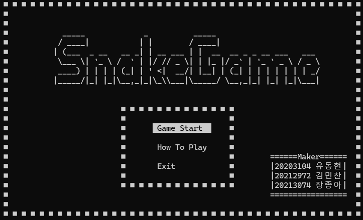
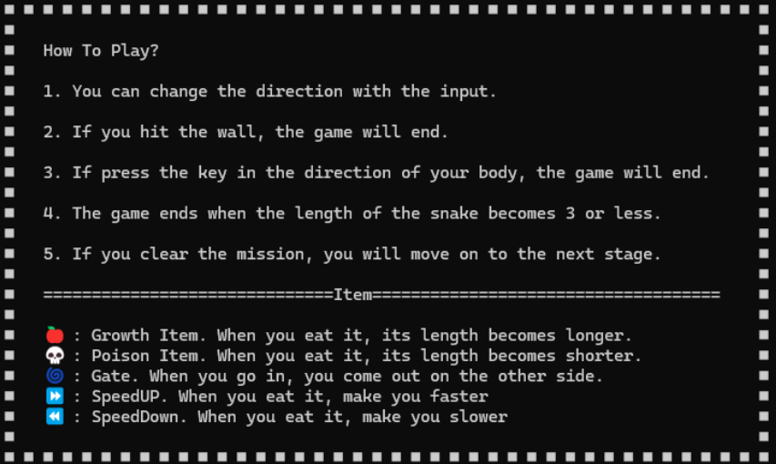
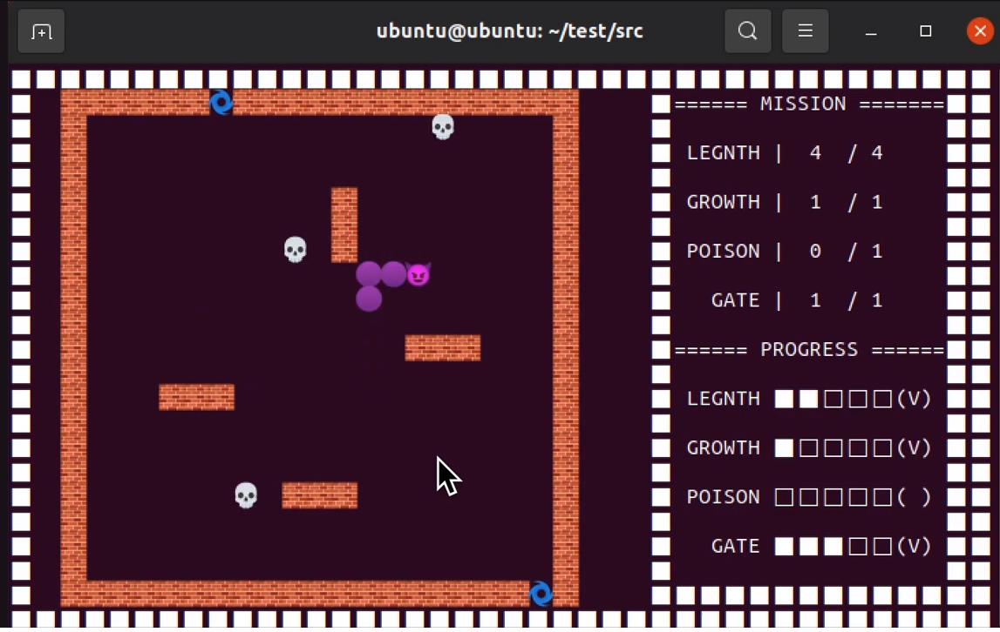

# 🐍**SNAKE GAME**

    Kookmin Univ. C++ SNAKE GAME Project  
    

## How to RUN?
#### Install libncurses
    $ sudo apt-get update && sudo apt-get install libncurses5-dev libncursesw5-dev

#### g++ -o snake <every .cpp files> -lncursesw 
    $ g++ -o snake main.cpp SnakeGame.cpp Snake.cpp Map.cpp Item.cpp Gate.cpp Mission.cpp ScoreBoard.cpp StageManager.cpp Score.cpp -lncursesw

#### or just use make
    $ make

## Unicode Character
    wall = L'◼'; 
    head = L'●';
    body = L'○';

    ◼ : \u25fc
    ● : \u25cf
    ○ : \u25cb

## InGame

